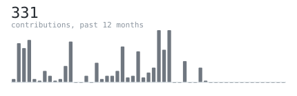
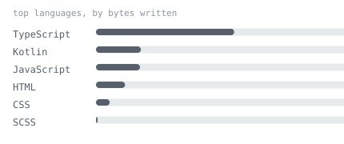

[github](https://github.com/rishamsandhuu) &nbsp;·&nbsp;
[linkedin](https://www.linkedin.com/in/rishamsandhuu/) &nbsp;·&nbsp;
[email](mailto:rishamsandhu01@gmail.com)

> CS grad from George Brown College, based in the GTA. 
> I like building things that actually get used.

Working as a web developer, and building on the side.  
Currently working on [Pebble](https://github.com/whatnirja/pebble) 
— a care platform for seniors and the people looking after them, built as my 
capstone for people who genuinely needed it.

<samp>typescript &nbsp; kotlin &nbsp; swift &nbsp; react &nbsp; react native &nbsp; gemini api &nbsp; java &nbsp; node.js &nbsp; express &nbsp; mongodb &nbsp; firebase &nbsp; supabase</samp>

**[Pebble](https://github.com/whatnirja/pebble)** &nbsp;·&nbsp; <samp>react native, node.js</samp> 
A care app for seniors, their family, and caregivers — SOS with live GPS, 
medication and appointment tracking, hands-free voice-to-text for adding 
tasks and reminders, and role-based access so everyone sees only what they 
need to.

**[youre-in-debt](https://github.com/whatnirja/youreindebt)** &nbsp;·&nbsp; <samp>typescript, react, supabase pgvector, gemini</samp> 
Shows Ontario students the real impact of the 2026 OSAP cuts. A Chrome 
extension flags tuition pages, backed by OpenAI embeddings, Supabase pgvector 
search, and Gemini reasoning over each student's eligibility.

